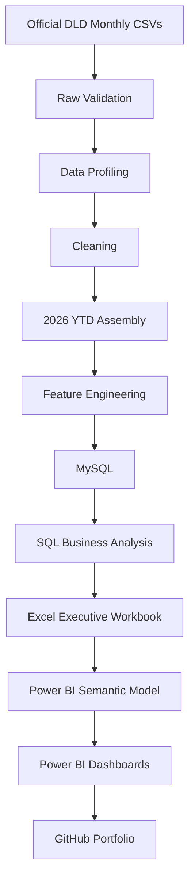
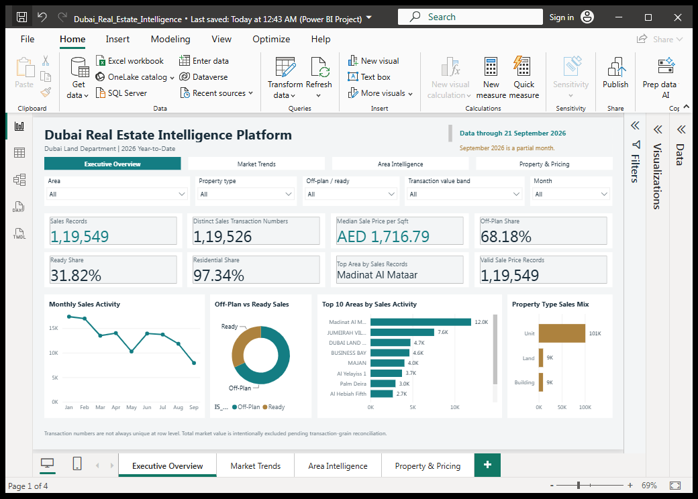
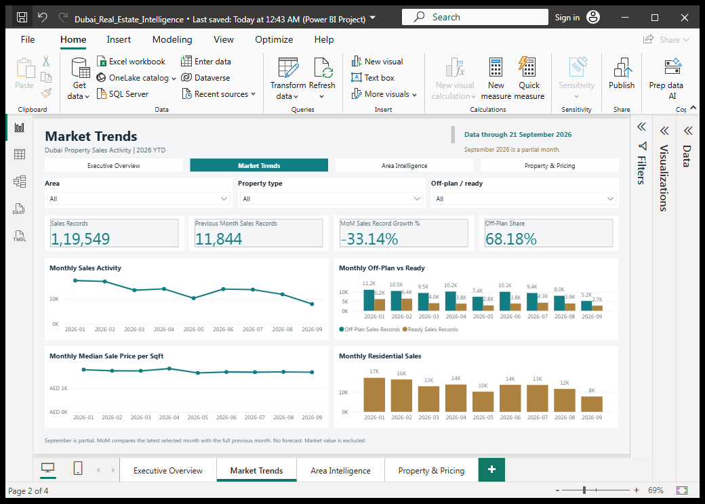
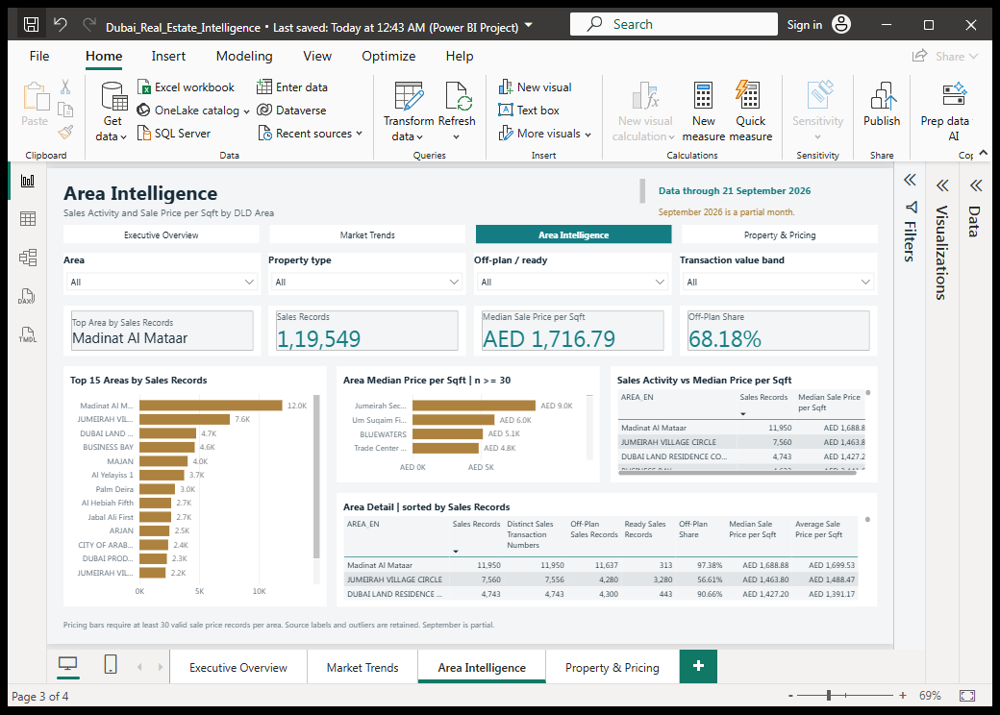
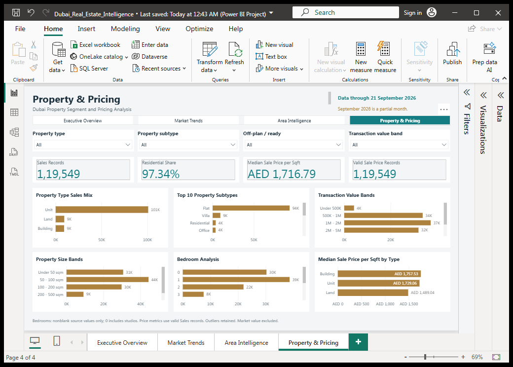

# Dubai Real Estate Intelligence Platform

End-to-End Data Analytics Portfolio Project using Python, MySQL, SQL, Excel and Power BI

**159,223 records · 41 source/analytical columns · 21 DAX measures · 4 Power BI pages**

[3–5 minute walkthrough](docs/RECRUITER_WALKTHROUGH.md) · [Architecture](docs/PROJECT_ARCHITECTURE.md) · [Stage summary](docs/PROJECT_STAGE_SUMMARY.md)

## Project Overview

This project analyzes official Dubai Land Department (DLD) real-estate transaction data for **January 2026 through 21 September 2026**. It follows the data from monthly CSV validation and cleaning through MySQL analysis, an Excel executive workbook implementation, and a Power BI semantic model and dashboard.

The focus is sales activity, property mix and comparable price-per-area measures. Validation reports connect the results to their source, and explicit data-grain rules determine which KPIs are defensible. **September 2026 is a partial month**; its activity is not directly comparable with a complete month.

## Business Questions

- How is Dubai property sales activity changing month by month?
- What share of sales is Off-Plan versus Ready?
- Which areas have the highest sales activity?
- How does median sale price per sqft differ by area?
- Which property types and subtypes dominate activity?
- How do property value bands, size bands and bedrooms differ?

## Tech Stack

| Tools | Role |
| --- | --- |
| Python, Pandas | Validation, profiling, cleaning, features and reproducible outputs |
| MySQL, SQL | Typed storage, grain audit, validation and business analysis |
| Excel | Executive workbook, analysis tables, sample and data dictionary |
| Power BI, DAX, Power Query | Semantic model, measures, typed import and interactive reporting |
| Git, GitHub | Staged version history and portfolio presentation |

## Project Architecture



This is the project delivery sequence. Stage 3 cleans January separately; Stage 4 assembles the original monthly inputs and Stage 5 cleans the combined YTD data. Excel and Power BI both read the Stage 6 feature CSV directly; Power BI does not import the workbook. The [detailed architecture](docs/PROJECT_ARCHITECTURE.md) shows these data dependencies.

## Dataset

| Attribute | Verified scope |
| --- | --- |
| Source | Official Dubai Land Department transaction data |
| Coverage | 1 January–21 September 2026; September partial |
| Final analytics dataset | 159,223 records × 41 source/analytical columns |
| Transaction groups | Sales, Mortgages and Gifts; sales KPIs explicitly filter Sales |
| Local analytics file | `data/processed/dld_transactions_2026_ytd_features.csv` |

Bulk monthly source files and processed datasets are intentionally excluded from Git to keep the repository manageable. The existing [January sample](data/raw/dld_transactions_sample_2026_01.csv) remains tracked; full reproduction requires the other monthly files. No official download URL or download-date record is stored in this repository, so none is invented here.

## Data Pipeline

Stages 1–2 inspect the raw schema, missing values, dates, categories and repeated identifiers. Stage 3 removes only exact duplicates from January. Stage 4 assembles nine monthly sources; Stage 5 removes **231 exact duplicate rows**, leaving 159,223 records. Stage 6 adds sales/usage flags, valid sales price-per-area metrics, value and size bands, and supported bedroom mappings without dropping source rows.

See the [Python scripts](src/) and [stage-by-stage validation summary](docs/PROJECT_STAGE_SUMMARY.md). Source hashes and row/column checks are recorded in the [reports](reports/).

## SQL + MySQL Analysis

Stage 7 imports the 41-field analytics dataset into MySQL, adding a technical `ROW_ID` rather than treating the transaction number as a unique row key. Typed decimal fields, batch loading and reconciliation checks protect source precision and row counts. Stage 8 uses read-only SQL for monthly sales, shares, area comparisons, property segments and the transaction-grain audit.

Review the [schema](sql/01_create_mysql_schema.sql), [validation queries](sql/02_validation_queries.sql), [business analysis SQL](sql/03_business_analysis.sql) and [recorded results](reports/stage8_sql_business_analysis_report.txt).

**Why there is no Total Sales Value KPI:** `TRANSACTION_NUMBER` is not always unique at row level. Stage 8 found **772 repeated transaction numbers**, of which **476 contain multiple distinct `TRANS_VALUE` values**, across the complete dataset. Summing rows or selecting an arbitrary value per ID would assume an unverified valuation grain. The project deliberately excludes **Total Dubai Sales Value**, **Total Market Value** and **`SUM(TRANS_VALUE)` as a market KPI**. This is a data-grain decision, not a missing feature.

## Excel Analysis

The [Stage 9 implementation and validation report](reports/stage9_excel_workbook_report.txt) documents an executive workbook with **7 sheets**, **8 KPI cards**, analysis tables, a **5,000-row deterministic sample** and a **41-field data dictionary**. Summaries use the complete dataset; the sample is for inspection. Sheets cover Executive Summary, Monthly Analysis, Area Analysis, Segment Analysis, Data Sample, Data Dictionary and Notes.

**Workbook status:** the [Excel workbook](excel/Dubai_Real_Estate_Intelligence_2026_YTD.xlsx) passes ZIP/openpyxl validation and opens normally in native Microsoft Excel. Stage 12 initially found a ZIP offset error; the interrupted repair had already regenerated the workbook, which recovery preserved without rebuilding. Validation confirms **4 executive charts**, all **68 formulas**, the exact sample and dictionary, and an unchanged source CSV. The [Stage 12 recovery report](reports/stage12_portfolio_packaging_report.txt) records the repair history and native Excel evidence.

## Power BI Dashboard

The [Power BI project](powerbi/Dubai_Real_Estate_Intelligence/Dubai_Real_Estate_Intelligence.pbip) contains `FactTransactions`, `DimDate` and **21 DAX measures**. A one-to-many date relationship supports chronological analysis. The fact table preserves the 41 input fields and adds two hidden band-sort helpers in Power Query.

| Page | Purpose |
| --- | --- |
| Executive Overview | Core sales KPIs, monthly activity, Off-Plan/Ready mix and leading areas |
| Market Trends | Monthly sales, median pricing, sales mix and residential share, with partial-month context |
| Area Intelligence | Area activity rankings, median price comparisons and area detail tables |
| Property & Pricing | Property types/subtypes, price metrics, value bands, size bands and bedrooms |

[Stage 11 evidence](powerbi/validation/stage11/README.md) records native Desktop opening, refresh, all 21 measures, page rendering and selected slicer tests. This is a local Power BI Desktop project; Power BI Service deployment is future work.

## Key Insights

These are unfiltered snapshot results. Shares use **sales records**, not all transaction groups or distinct transaction numbers.

| Metric | Verified result |
| --- | ---: |
| Sales records | 119,549 |
| Distinct sales transaction numbers | 119,526 |
| Median sale price per sqft | AED 1,716.79 |
| Off-Plan share of sales records | 68.18% |
| Ready share of sales records | 31.82% |
| Residential share of sales records | Approximately 97.34% |
| Top area by sales records | Madinat Al Mataar |

The count and pricing measures were reconciled against the source in [Stage 11](reports/stage11_powerbi_advanced_report.txt). **September covers only through 21 September**; a lower partial-month count is not evidence of a full-month market decline. Results describe this dataset and do not constitute investment recommendations.

## Screenshots

Final validated native Desktop captures, copied without alteration. Executive Overview has its slicer selection cleared. Desktop chrome, local number formatting and scrollable chart/table content are retained.

### Executive Overview



### Market Trends



### Area Intelligence



### Property & Pricing



## Repository Structure

```text
.
|-- data/          # Raw sample; local monthly inputs and processed outputs
|-- src/           # Python validation, preparation, loading and Excel builder
|-- sql/           # MySQL schema, validation and business analysis
|-- excel/         # Validated seven-sheet executive workbook
|-- powerbi/       # PBIP, semantic model, report definitions and validation evidence
|-- reports/       # Recorded stage results and validation reports
|-- docs/          # Architecture, walkthrough, interview and resume material
|-- images/        # Four selected portfolio screenshots
|-- notebooks/    # Reserved placeholder
|-- requirements.txt
|-- README.md
`-- LICENSE
```

## How to Run

Use **Python 3.12** (recommended). Open a PowerShell terminal in the project root:

```powershell
python -m venv .venv
.\.venv\Scripts\Activate.ps1
pip install -r requirements.txt
```

The [requirements file](requirements.txt) contains the existing dependencies; versions are currently unpinned. Reviewing the screenshots, SQL and reports requires no database connection.

**Source files.** Keep January at `data/raw/dld_transactions_sample_2026_01.csv`. Supply the official February–September files in `data/external/2026_monthly/`, named `dld_transactions_2026_02.csv` through `dld_transactions_2026_09.csv`. They must match the expected original 22-column schema. The repository cannot reproduce the full YTD output from January alone.

**Python pipeline.** In a reproduction checkout with all inputs present, run:

```powershell
python src/01_validate_raw_data.py
python src/02_profile_data.py
python src/03_clean_transform_data.py
python src/04_build_2026_ytd_dataset.py
python src/05_clean_2026_ytd.py
python src/06_engineer_features.py
```

Stages 3–6 write their processed outputs and reports. Stage 4 uses the original sources rather than the Stage 3 January output.

**MySQL and SQL.** Install MySQL 8.0+ separately. Run [the schema script](sql/01_create_mysql_schema.sql) in MySQL Workbench or a MySQL client. Create a private, ignored `.env` containing your own `MYSQL_HOST`, `MYSQL_PORT`, `MYSQL_USER`, `MYSQL_PASSWORD` and `MYSQL_DATABASE`; the database name is `dubai_real_estate_intelligence`. Then run `python src/07_load_mysql.py`. The loader requires an empty target table and never clears an existing table. Run the [validation](sql/02_validation_queries.sql) and [business analysis](sql/03_business_analysis.sql) scripts afterward.

**Excel.** After generating the feature CSV, `python src/09_build_excel_workbook.py` rebuilds the workbook and Stage 9 report. This overwrites those outputs; use a reproduction checkout and validate the regenerated file in Excel. The targeted Stage 12 repair regenerated the damaged artifact before interruption. Recovery preserved that healthy workbook and fixed the generator's Windows file-handle release before ZIP replacement; analytical logic is unchanged.

**Power BI.** In Power BI Desktop with PBIP support, open:

```text
powerbi/Dubai_Real_Estate_Intelligence/Dubai_Real_Estate_Intelligence.pbip
```

Set the Power Query `SourceFile` parameter to your local absolute path for `data/processed/dld_transactions_2026_ytd_features.csv`, then refresh. The imported cache is excluded from Git. Stage 11 validation used Desktop **2.157.1354.0**; other versions have not been validated.

## Data Quality Decisions

- Remove exact duplicate source rows only; retain repeated transaction IDs when the rows differ and may represent legitimate records.
- Calculate sales price-per-area only for Sales with positive transaction value and area, using the validity flag in downstream measures.
- Preserve official DLD labels, including capitalization variants, and keep unknown bedrooms unmapped.
- Retain price outliers and missing source fields; no silent filtering, capping or invented replacements.
- Disclose September's partial coverage and preserve records outside a source file's named month using their actual dates.
- Distinguish records from distinct transaction numbers and withhold unsupported market-value totals.

## Limitations

- September is partial; month-on-month comparisons with August are not like-for-like full-month comparisons.
- Official label capitalization variants remain separate; price outliers remain in the dataset.
- Unresolved transaction grain prevents naive Total Sales Value aggregation.
- Bulk source/processed CSVs are not committed; full reproduction needs local inputs. The exact source download URL/date is not recorded.
- Native Excel validation covers the repaired workbook on the installed Excel 14.0 build 4734; other versions were not tested during recovery.
- Some Desktop visuals scroll at the captured resolution. Validation covered selected slicer scenarios, not every combination. Historical evidence retains machine-specific paths; the Power BI source parameter requires local setup.

## Future Improvements

Automated monthly ingestion, semantic area mapping, transaction-grain reconciliation, Power BI Service deployment, scheduled refresh and expanded historical coverage would build on this foundation.

## Author / Portfolio

- **Author:** [Your name]
- **GitHub profile:** To be added by the author
- **LinkedIn profile:** To be added by the author
- **Portfolio website:** To be added by the author, if applicable

[Resume project entry](docs/RESUME_PROJECT_ENTRY.md) · [Interview talking points](docs/INTERVIEW_TALKING_POINTS.md) · [Recruiter walkthrough](docs/RECRUITER_WALKTHROUGH.md)

Project code is covered by the [MIT License](LICENSE). Source data remains subject to its provider's terms.
