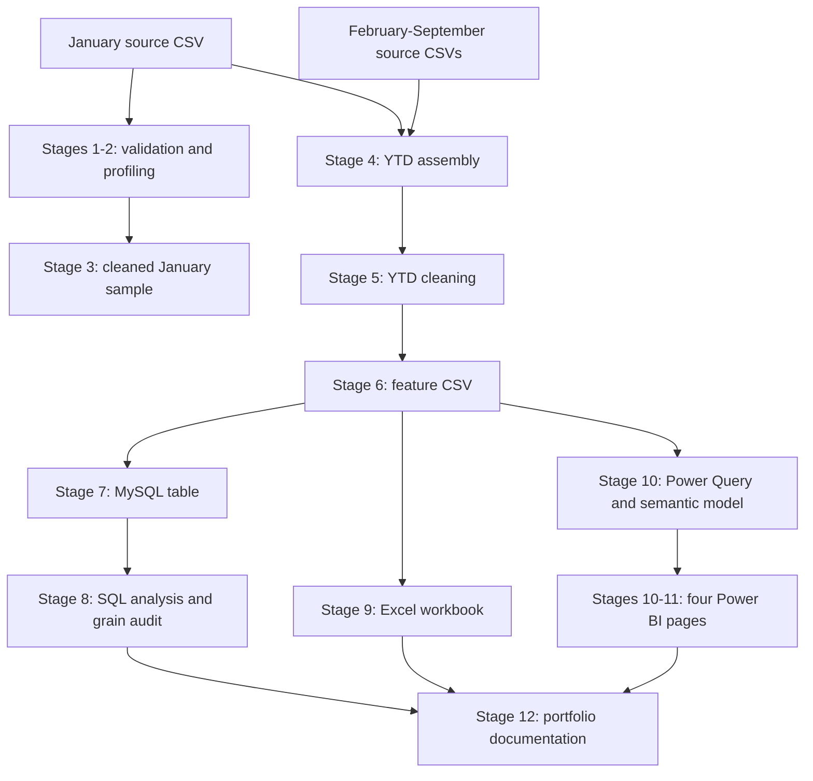

# Project Architecture

The platform follows official Dubai Land Department transaction records from validation to portfolio presentation. The final analytical snapshot contains **159,223 records and 41 source/analytical columns**, covering **1 January–21 September 2026**. September is a partial month.

## Delivery sequence

This diagram shows the project's delivery stages. The Excel-to-Power-BI arrow describes the order of work; Excel is not the Power BI data source.

## Actual data flow

Stage 3 cleans the January sample as a separate preparation exercise. Stage 4 assembles the **original** nine monthly CSVs; Stage 5 then cleans that assembled YTD dataset. Neither the Stage 3 output nor the Excel workbook supplies Power BI.

## Folder responsibilities

| Folder | Responsibility |
| --- | --- |
| [`data/`](../data/) | Local monthly inputs and processed CSVs. The January sample is tracked; bulk monthly inputs and processed datasets are excluded from Git. |
| [`src/`](../src/) | Numbered Python scripts for validation, preparation, feature engineering, MySQL loading and workbook generation. |
| [`sql/`](../sql/) | MySQL schema, import validation queries and read-only business analysis. |
| [`excel/`](../excel/) | Executive workbook artifact. |
| [`powerbi/`](../powerbi/) | Native PBIP, report/model definitions, theme, specifications and preserved validation evidence. |
| [`reports/`](../reports/) | Recorded stage results, counts, quality decisions and protection checks. |
| [`docs/`](../docs/) | Architecture, stage summary and portfolio presentation guides. |
| [`images/`](../images/) | Curated copies of final dashboard screenshots for the README. |

## Python pipeline: Stages 1–6

Stages 1–2 print a read-only profile of the January sample. Stage 3 removes 31 exact duplicates from that sample. These scripts do not establish transaction-number uniqueness.

Stage 4 combines nine monthly sources into 159,454 records with their 22 original fields. It reports and retains 1,128 records that fall outside their file's named month. Stage 5 removes 231 exact duplicates across the original fields, retains legitimate repeated transaction numbers and adds eight date fields. Stage 6 preserves all 159,223 rows and 30 existing columns while adding 11 analytical features, producing `data/processed/dld_transactions_2026_ytd_features.csv`.

Features include Sales/residential/off-plan/freehold flags, size in square feet, Sales-only price per area, value/size bands and mapped bedroom counts. Missing or unmapped bedrooms are not guessed. Outliers and official labels remain intact. See the [stage summary](PROJECT_STAGE_SUMMARY.md) for script and report links.

## MySQL and SQL: Stages 7–8

The [schema](../sql/01_create_mysql_schema.sql) stores the 41 analytical fields plus a generated `ROW_ID`. `TRANSACTION_NUMBER` is deliberately non-unique. Binary collation preserves official label differences. The [loader](../src/07_load_mysql.py) validates field types and precision, requires an empty table, and uses one InnoDB transaction for its batches. Recorded import checks reconcile all 159,223 records with the source CSV.

The [business analysis](../sql/03_business_analysis.sql) uses read-only SQL, including CTEs and window functions, for monthly activity, market segments, area benchmarks and data-quality checks. Its grain audit found **772 repeated transaction numbers**, including **476 with multiple distinct `TRANS_VALUE` values**. Choosing a single value per identifier is not defensible without source-grain reconciliation. Total Dubai Sales Value, Total Market Value and `SUM(TRANS_VALUE)` as a market KPI are intentionally absent.

## Excel: Stage 9

The [generator](../src/09_build_excel_workbook.py) reads the Stage 6 CSV directly. The [Stage 9 report](../reports/stage9_excel_workbook_report.txt) records seven sheets, eight KPI cards, full-source analysis tables, a deterministic 5,000-row sample and a 41-field data dictionary. The sample supports inspection; it does not supply the executive KPIs.

**Excel recovery status:** The earlier ZIP offset error was resolved by regeneration before recovery resumed. The current [XLSX](../excel/Dubai_Real_Estate_Intelligence_2026_YTD.xlsx) opens programmatically and in native Microsoft Excel, and passes sheet, KPI, chart, sample, dictionary and formula checks. Recovery preserved the regenerated workbook unchanged. The [Stage 12 report](../reports/stage12_portfolio_packaging_report.txt) records the repair history and native Excel result.

## Power BI: Stages 10–11

Open the [native PBIP](../powerbi/Dubai_Real_Estate_Intelligence/Dubai_Real_Estate_Intelligence.pbip). Power Query reads the Stage 6 CSV through the `SourceFile` parameter, validates the schema and applies types without changing the source. The parameter must point to the local feature CSV on another machine.

`FactTransactions` contains the 41 source fields plus two hidden band-sort helpers. `DimDate` contains the 2026 calendar. An active one-to-many relationship filters transactions from the date table. The model contains **21 DAX measures**, reused across four analytical pages: Executive Overview, Market Trends, Area Intelligence, and Property & Pricing. Sales measures distinguish row counts from distinct transaction numbers; price measures require valid Sales prices.

The [Stage 11 evidence](../powerbi/validation/stage11/) records Desktop refresh, live DAX checks, rendered pages and selected interaction checks. It is retained alongside the report definitions. Power BI Service deployment and scheduled refresh are future work, not completed capabilities.

## Git and GitHub workflow

The numbered stages preserve traceability between code, outputs and validation reports. Review changes with `git status` and `git diff`; keep credentials in an ignored local `.env`, and keep generated caches and bulk datasets outside version control. The small January source sample remains tracked as an existing repository decision.

Stage 12 adds documentation and screenshot copies and includes targeted Excel integrity recovery while preserving analytical logic, source data and completed packaging. Verify source SHA-256 hashes and relative links before review. Stage 12 changes are left uncommitted for the owner's approval; no production deployment is claimed.
